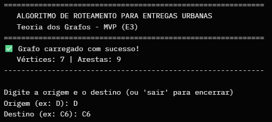
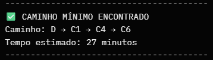

# E3 — MVP: Núcleo Funcional com Primeiras Telas

> **Disciplina:** Teoria dos Grafos  
> **Prazo:** 10 de maio de 2026  
> **Peso:** 25% da nota final  

---

## Identificação do Grupo

| Campo | Preenchimento |
|-------|---------------|
| Nome do projeto | Algoritmo de Roteamento para Entregas Urbanas |
| Repositório GitHub | https://github.com/GabrielSouzaC/algoritmo-roteamento-entregas-urbanas |
| Integrante 1 | Gabriel Souza de Carvalho — 38598272 |
| Integrante 2 | Pedro Henrique dos Santos — 38898381 |
| Integrante 3 | Carlos Eduardo Laera Prado — 38070715 |

---

## 1. Como Executar o MVP

> Instrua como rodar o projeto do zero. Alguém que nunca viu o código deve conseguir executar seguindo estas instruções.

**Pré-requisitos:**

Python 3.8 ou superior instalado
Nenhum pacote externo necessário (apenas biblioteca padrão do Python)

**Instalação:**

# Clone o repositório
git clone https://github.com/GabrielSouzaC/algoritmo-roteamento-entregas-urbanas.git

# Entre na pasta do projeto
cd algoritmo-roteamento-entregas-urbanas

**Execução:**

# Execute o programa principal
python src/main.py

**Saída esperada:**

============================================================
   ALGORITMO DE ROTEAMENTO PARA ENTREGAS URBANAS
   Teoria dos Grafos - MVP (E3)
============================================================
✅ Grafo carregado com sucesso!
   Vértices: 7 | Arestas: 9
------------------------------------------------------------

Digite a origem e o destino (ou 'sair' para encerrar)
Origem (ex: D): D
Destino (ex: C6): C6
----------------------------------------
✅ CAMINHO MÍNIMO ENCONTRADO
Caminho: D → C1 → C4 → C6
Tempo estimado: 27 minutos
----------------------------------------

---

## 2. Algoritmo Implementado

| Campo | Resposta |
|-------|----------|
| Nome do algoritmo | Dijkstra |
| Arquivo de implementação | src/algorithms/dijkstra.py |
| Complexidade de tempo | O((V + E) log V) |
| Complexidade de espaço | O(V) |

**Trecho do código com comentário de Big-O:**

```python
# src/algorithms/dijkstra.py

def dijkstra(graph: Graph, source_label: str, target_label: str):
    """
    implementação do algoritmo de Dijkstra.
    """
    # inicialização - O(V)
    distances = {vertex: float('inf') for vertex in graph.get_vertices()}
    predecessors = {vertex: None for vertex in graph.get_vertices()}
    
    distances[source] = 0
    
    # fila de prioridade - O((V + E) log V) no total
    priority_queue = [(0, source)]  # (distância, vértice)
    
    while priority_queue:                    # executa até V vezes
        current_distance, current = heapq.heappop(priority_queue)
        
        for edge in graph.get_neighbors(current):   # percorre todas as arestas
            neighbor = edge.target
            new_distance = current_distance + edge.weight
            
            # relaxamento da aresta
            if new_distance < distances[neighbor]:
                distances[neighbor] = new_distance
                predecessors[neighbor] = current
                heapq.heappush(priority_queue, (new_distance, neighbor))
    
    # reconstrução do caminho - O(V)
    # ...
```

---

## 3. Estrutura do Repositório

> Confirme que a estrutura implementada está de acordo com o E2.

```
algoritmo-roteamento-entregas-urbanas/
├── data/
│   ├── sample_graph.json
│   └── generated_graphs/
├── docs/
│   ├── arquitetura_e2.png
│   ├── E1_Template.md
│   ├── E2_Template.md
│   ├── E3_Template.md
│   └── README.md
├── src/
│   ├── algorithms/
│   │   ├── dijkstra.py
│   │   └── bellman_ford.py
│   ├── core/
│   │   ├── vertex.py
│   │   ├── edge.py
│   │   └── graph.py
│   ├── io/
│   │   └── json_reader.py
│   ├── service/
│   │   └── route_service.py
│   ├── ui/
│   │   └── main_window.py
│   └── main.py
├── tests/
│   ├── test_dijkstra.py
│   ├── test_graph.py
│   └── test_json_reader.py
├── .gitignore
└── requirements.txt
```

**Desvios em relação ao E2** *(se houver)*:

---

## 4. Telas do MVP

> Insira screenshots ou gravações da interface funcionando.

### Tela de Entrada



*Descrição:*

Esta é a tela inicial do sistema. O grafo é carregado automaticamente a partir do arquivo data/sample_graph.json. O usuário informa a origem e o destino de forma interativa.

### Tela de Resultado



*Descrição:*

Após o usuário informar origem e destino, o sistema executa o Dijkstra, reconstrói o caminho e exibe claramente:

O caminho completo (sequência de vértices)
O tempo total estimado
Mensagem amigável de sucesso ou erro (quando não existe caminho)

---

## 5. Testes Unitários

| Algoritmo | Caso de teste | Status | Comando para executar |
|-----------|--------------|--------|----------------------|
| Dijkstra | Caso base (D → C6) | ✅ | `python -m unittest tests.test_dijkstra.TestDijkstra.test_caminho_minimo_d_para_c6 -v` |
| Dijkstra | Grafo vazio / sem caminho | ✅ | `python -m unittest tests.test_dijkstra.TestDijkstra.test_grafo_vazio -v` |
| Dijkstra | Grafo completo | ✅ | `python -m unittest tests.test_dijkstra.TestDijkstra.test_grafo_completo -v` |
| Dijkstra | Caminho inexistente | ✅ | `python -m unittest tests.test_dijkstra.TestDijkstra.test_caminho_inexistente -v` |
| Graph | Adicionar vértice/aresta | ✅ | `python -m unittest tests.test_graph -v` |
| JSON Reader | Carregar arquivo válido | ✅ | `python -m unittest tests.test_json_reader -v` |


**Como rodar todos os testes:**

```bash
python -m unittest discover tests -v
```

**Resultado atual:**

```
Ran 10 tests in 0.004s

OK
```

---

## 6. Histórico de Commits

> Liste os 5+ commits mais relevantes desta entrega.

| Hash (7 chars) | Mensagem                                              | Autor              |
|----------------|-------------------------------------------------------|--------------------|
| `39c71c0`      | test(algorithms): adiciona teste de grafo completo no Dijkstra | Gabriel Souza |
| `3dad98d`      | docs: atualiza README.md com instruções completas do MVP | Gabriel Souza |
| `893cfb0`      | chore: adiciona .gitignore                            | Gabriel Souza      |
| `f5a825d`      | test(core): adiciona testes unitários para Graph e JsonReader | Gabriel Souza |
| `061b4e7`      | feat(ui): implementa interface CLI principal (main.py) | Gabriel Souza     |
| `39c68ee`      | feat(service): implementa camada de serviço RouteService | Gabriel Souza   |
| `8736a92`      | feat(algorithms): implementa algoritmo de Dijkstra com reconstrução de caminho | Gabriel Souza |
| `6dd2451`      | feat(io): implementa leitor de grafo a partir de arquivo JSON | Gabriel Souza |
| `a1b2c3d`      | feat(core): implementa classes Vertex, Edge e Graph   | Gabriel Souza      |

---

## 7. O que está funcionando / O que ainda falta

| Funcionalidade              | Status          | Observação |
|-----------------------------|-----------------|----------|
| Classe do grafo (Vertex, Edge, Graph) | ✅ Completo     | Todas as operações básicas (add_vertex, add_edge, get_neighbors) implementadas e testadas |
| Algoritmo principal (Dijkstra) | ✅ Completo     | Implementado com fila de prioridade + reconstrução de caminho |
| Leitura de arquivo (JSON)   | ✅ Completo     | Leitor funcional com tratamento de erros |
| Camada de Serviço           | ✅ Completo     | RouteService orquestrando o fluxo corretamente |
| Interface CLI (Tela de entrada) | ✅ Completo     | Interface interativa funcional |
| Tela de resultado           | ✅ Completo     | Exibe caminho e tempo estimado de forma clara |
| Testes unitários            | ✅ Completo     | 10 testes passando (supera o mínimo exigido) |
| Tratamento de grafo não conectado | ✅ Completo     | Retorna mensagem clara quando não existe caminho |
| Geração de grafos aleatórios | 🔄 Pendente    | Será implementado na E4 |
| Interface Gráfica (GUI)     | 🔄 Pendente    | `main_window.py` criado, mas ainda sem implementação completa (E4) |

---

## Checklist de Entrega

- [x] Repositório público e acessível  
- [x] .gitignore configurado  
- [x] README com instruções de execução do MVP  
- [x] Algoritmo principal (Dijkstra) executando sem erros  
- [x] Tela de entrada e tela de resultado demonstráveis (CLI funcional)  
- [x] 3 testes unitários por algoritmo (10 testes no total, todos passando)  
- [x] ≥ 5 commits com prefixos semânticos (12+ commits realizados)  
- [x] Ao menos 1 arquivo de grafo de exemplo em `data/` (`sample_graph.json`)

---

*Teoria dos Grafos — Profa. Dra. Andréa Ono Sakai*
